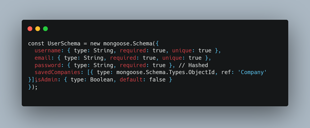
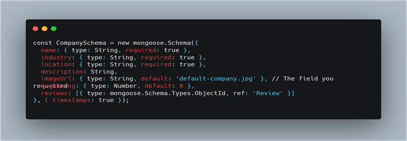
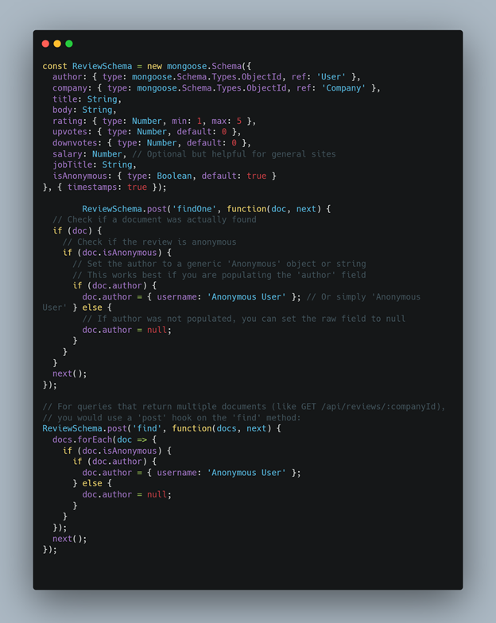

# Job-Jury

> _“Don't just take the job. Hear the jury.”_

**Author:** Zachary Baca

## Overview

This is a MERN stack web application that provides users a platform to review their current or former place of employment. In return, this provides unbiased reviews on workplace environments to help job seekers make informed decisions.

## Goals

The application addresses the lack of transparency in the workplace. Users can verify if a company's culture aligns with their values before committing to an interview process.

## Specifications

### Database Schema(s)

### User Schema



### Company Schema



### Review Schema



### Frontend Component Layout

* **Layout Components**
  * `Navbar`: Includes search bar and user profile/login.
    * `Footer`: Standard links and "Add a Company" CTA.
* **Company Components**
  * `CompanyCard`: Small preview used in search results.
    * `CompanyHeader`: Hero section with company image and average rating.
    * `ImageUpload`: Handling file selection and previewing.
* **Review Components**
  * `ReviewList`: Maps through the array of reviews.
  * `ReviewForm`: Star-rating system and text areas.
* **Utility Components**
  * `ProtectedRoute`: Ensures only logged-in users can post.
  * `SearchBar`: Live filtering for industries and locations.

## API Routes

### Company and Reviews

| Method | Description | Endpoint |
| :--- | :--- | :--- |
| GET | Fetch all/filter companies | `/api/companies` |
| POST | Create new company | `/api/companies` |
| GET | Fetch individual company | `/api/companies/:companyId` |
| PUT | Update company info | `/api/companies/:companyId` |
| POST | Add review & update avgRating | `/api/reviews/:companyId` |
| DELETE | Delete a review | `/api/reviews/:companyId/:reviewId` |

### Authentication

| Method | Description | Endpoint |
| :--- | :--- | :--- |
| POST | User Signup | `/api/auth/register` |
| GET | Fetch user profile | `/api/users/:userId` |
| PUT | Update user profile | `/api/users/:userId` |

## Technology Stack

### Backend

* **Node.js & Express:** Server environment and routing.
* **MongoDB & Mongoose:** NoSQL Database and object modeling.
* **Cloudinary & Multer:** Image storage and middleware handling.

### Frontend

* **ReactJS:** UI Library.
* **Context API:** Global state management.

### Security

* **JWT:** Authentication via HTTP-Only Cookies.
* **BcryptJS:** Password hashing.
* **Helmet & CORS:** Header security and cross-origin resource sharing.

## Environment Variables

To run this project locally, you will need to create a `.env` file in the `server` directory and include the following variables:

```env
# Database Connection
MONGO_URI=your_mongodb_connection_string

# Authentication Secrets
JWT_SECRET=your_super_secret_jwt_key
JWT_EXPIRES_IN=7d

# Cloudinary Configuration (For Image Storage)
CLOUDINARY_CLOUD_NAME=your_cloud_name
CLOUDINARY_API_KEY=your_api_key
CLOUDINARY_API_SECRET=your_api_secret

# Server Port
PORT=5000

# Security
NODE_ENV=development

```

### Installation Setup

To get a local copy up and running, follow these steps.

1. Prerequisites
Ensure you have Node.js and npm installed on your machine. You will also need a MongoDB account (Atlas or local) and a Cloudinary account for image handling.

2. Clone the Repository

```bash
git clone https://github.com/your-username/job-jury.git
cd job-jury
```

1. Install Dependencies
You will need to install dependencies in three locations: the root, the server, and the client.

Install Root Dependencies (includes Concurrently):

```bash
npm install
```

Install Server Dependencies:

```bash
cd server && npm install
```

Install Client Dependencies:

```bash
cd ../client && npm install
```

1. Configure Scripts
To make the application easy to run, ensure your root-level package.json includes the following scripts:

```json
"scripts": {
  "start": "node server/server.js",
  "server": "nodemon server/server.js",
  "client": "npm start --prefix client",
  "dev": "concurrently \"npm run server\" \"npm run client\""
}
```

1. Running the Application
From the root directory of the project, run:

```bash
npm run dev
```

This command uses concurrently to boot up your Express server (usually on port 5000) and your React development server (usually on port 3000) at the same time.
